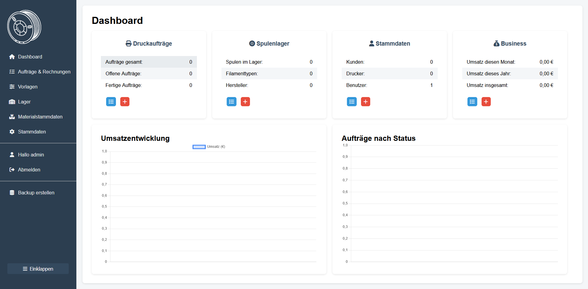
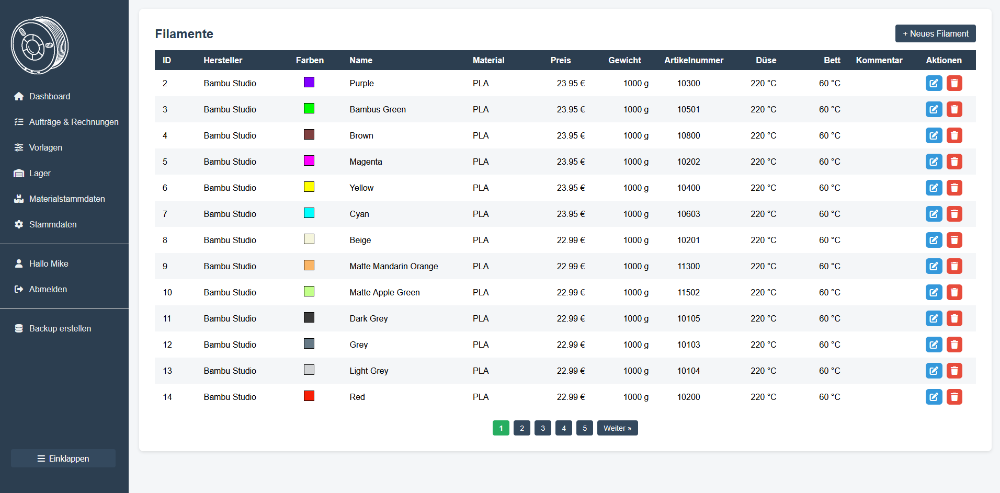
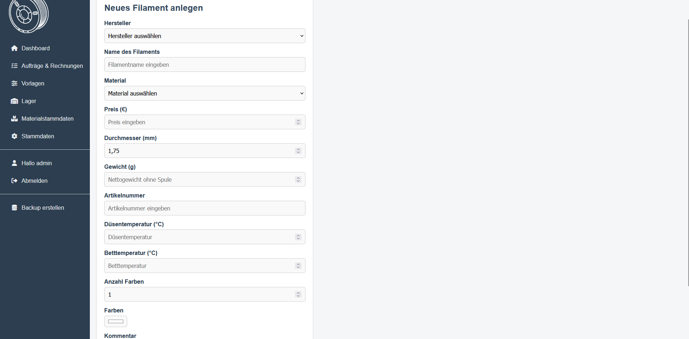
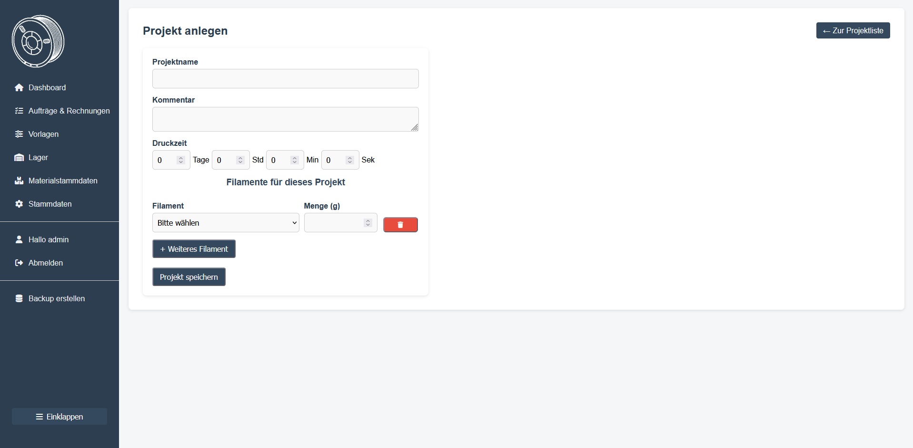
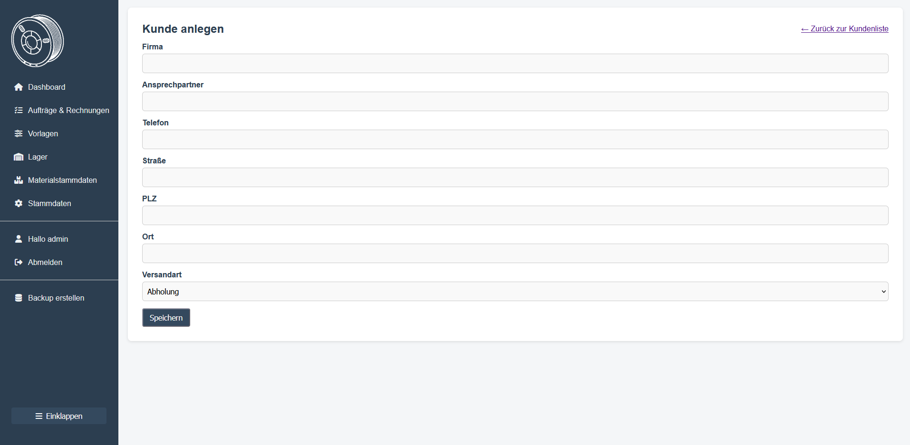
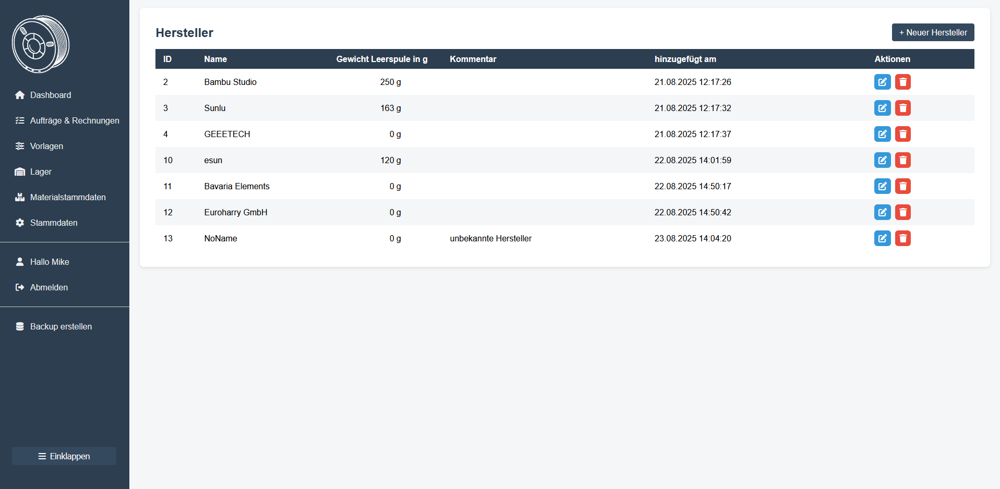
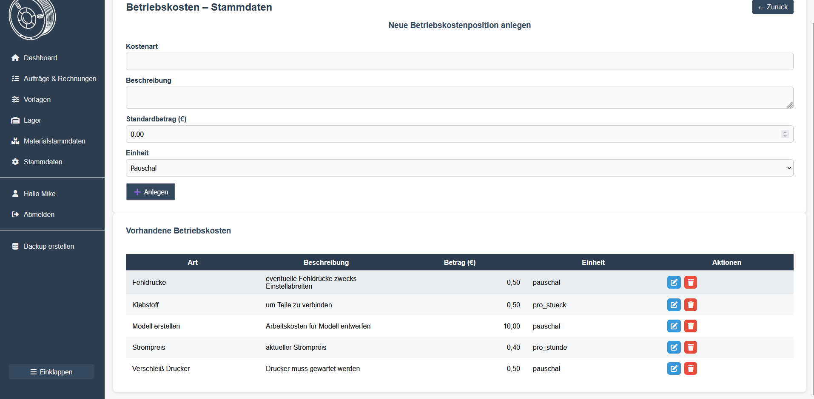
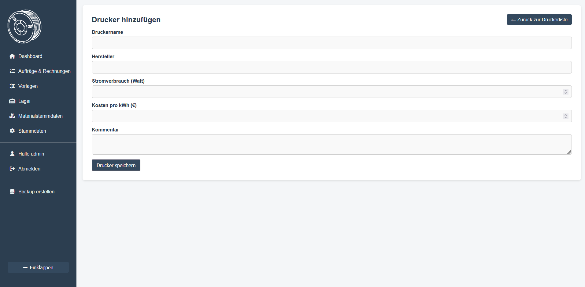

# 🎛️ Filamentlager – Verwaltungssystem für 3D-Druck
[](LICENSE)

Ein webbasiertes Verwaltungssystem für **Filamente, Spulen, Aufträge, Projekte und Rechnungen**.  
Geschrieben in **PHP + MySQL**, optimiert für XAMPP/Apache auf Windows oder Linux.

---

## 🚀 Features
- ✅ Hersteller, Materialien, Filamente und Spulen verwalten
- 📦 Aufträge anlegen, buchen und Rechnungen erstellen
- 📂 Projekte als Vorlagen nutzen
- 📊 Lagerbewegungen dokumentieren
- 👤 Benutzerverwaltung mit Rollen (User, Admin, Superuser, Readonly)
- 💾 Backup- und Restore-Funktionen (Projekt + Datenbank)

---

## 🛠 Voraussetzungen
- PHP ≥ 8.1  
- MySQL/MariaDB ≥ 10.x  
- Apache oder Nginx  
- Benötigte PHP-Extensions:
  - `mysqli`
  - `zip`
  - `mbstring`
  - optional: `gd`, `curl`

👉 Installation unter Ubuntu/Debian:
```
sudo apt install php php-mysqli php-zip php-mbstring php-gd php-curl mariadb-client
```
📦 Installation

1. Datenbank anlegen
```
CREATE DATABASE 3d_druck CHARACTER SET utf8mb4 COLLATE utf8mb4_general_ci;
```

2. Tabellen importieren
```
mysql -u USERNAME -p 3d_druck < sql/database-insert-sql.sql
```

3. Projektdateien kopieren

 - In das Webserver-Root legen:
	+ XAMPP: htdocs/filamentlager-iii/src/
	+ Linux/Apache: /var/www/src/

4. Datenbankzugang konfigurieren

+ src/db-example.php in db.php umbenennen und Zugangsdaten anpassen:
```
	$host = "localhost";
	$user = "deinuser";
	$pass = "deinpasswort";
	$dbname = "3d_druck"; // nicht ändern!
```
👣 Erste Schritte

1. Projekt im Browser öffnen:

	+ XAMPP: http://localhost/filamentlager-iii/src/

	+ Server: http://IP-ADRESSE/

2. Mit Standard-Login anmelden:

	Benutzername: admin
	Passwort: admin

3. Eigenen Benutzer anlegen → alten Admin auf readonly setzen.

4. Firmendaten unter Stammdaten → Firmendaten pflegen (benötigt für Rechnungen).

## 📸 Screenshots

| Dashboard                                             | Filamente Übersicht                                                    | Auftrag anlegen                                                   |
| ----------------------------------------------------- | ---------------------------------------------------------------------- | ----------------------------------------------------------------- |
|  |  |  |
| Filament anlegen                                                    | Projekt anlegen                                                   | Kundenverwaltung                                                  |
| ------------------------------------------------------------------- | ----------------------------------------------------------------- | ----------------------------------------------------------------- |
|  |  |  |
| Hersteller                                                      | Betriebskosten                                                          | Drucker                                                   |
| --------------------------------------------------------------- | ----------------------------------------------------------------------- | --------------------------------------------------------- |
|  |  |  |


📂 Projektstruktur
filamentlager-iii/
├─ docs/
│   └─ screenshots/
├─ sql/
│   └─ database-insert-sql.sql
├─ src/
│   ├─ index.php
│   ├─ db-example.php
│   ├─ db.php (ignoriert, lokal)
│   ├─ includes/
│   ├─ images/
│   ├─ css/
│   ├─ js/
│   └─ backups/
├─ .gitignore
├─ LICENSE
└─ README.md

📋 Menüpunkte

* Dashboard → Überblick über Lager & Aufträge

* Aufträge & Rechnungen → Aufträge erstellen, Rechnungen generieren

* Vorlagen → Projekte als Vorlagen speichern

* Lager → Spulen, Wareneingänge, Warenbewegungen

* Materialstammdaten → Filamente, Materialarten, Hersteller

* Stammdaten → Kunden, Drucker, Betriebskosten, Firmendaten, Benutzer & Rechte

* Backup erstellen → Projekt & Datenbank sichern (ZIP-Datei)

⚠️ Hinweis

Dies ist ein Privatprojekt.
Die Nutzung erfolgt auf eigene Gefahr – trotz großer Sorgfalt können Fehler im Code oder Abläufen bestehen.
Das Projekt wird aktiv weiterentwickelt. Feedback und Unterstützung sind willkommen!

🤝 Mitwirken

Pull Requests sind willkommen

Fehler oder Verbesserungsvorschläge bitte als GitHub Issues
 einreichen

📄 Lizenz

Dieses Projekt steht unter der MIT License
.